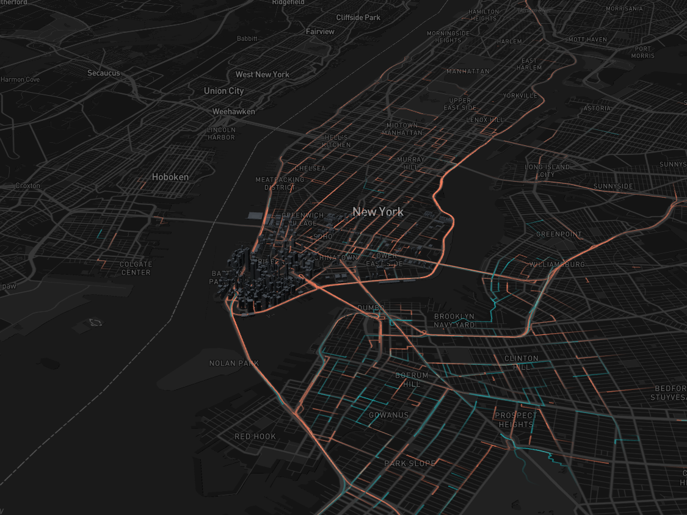
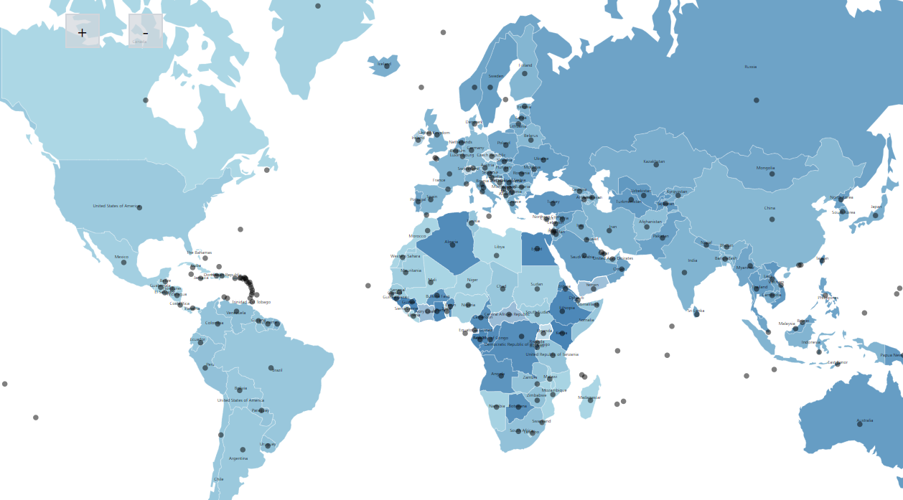
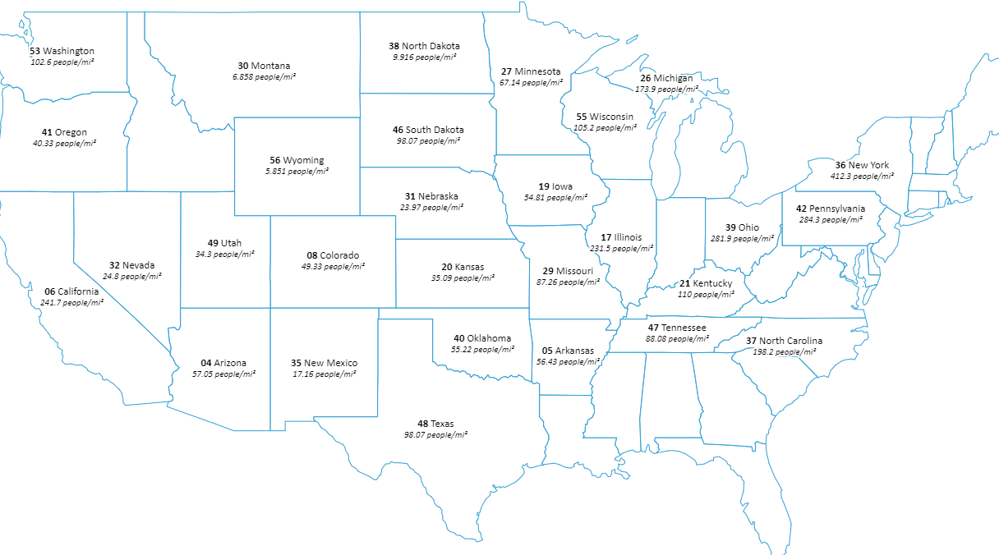

# Ptolemy

This repository aims to be an introduction into geospatial rendering and map-based data visualisation. This introduction covers several more common libraries in the context of geospatial mapping. The base page is setup using next with the possibility to server-side-rendering.



## Learned

- geospatial rendering
- create simple maps with navigation
- map-projections
- data visualisation on top of given map
- map-providers in the context of server-side-rendering with next js
- maptiles vs map rendering provider
- creation of managed map via svg with d4.js
- tile-provider
  - OpenStreetMap
  - MapBox (+ MapBox Studio)
- map rendering provider
  - leafelet js
  - openlayers
  - mapbox gl (+ react-map-gl)

## Prerequisites

- node v16+
- npm v8.5+

## Getting Started

This "Getting Started" section describes a sequence of steps which are needed to setup the given infrastructure. The assumend current state is: you own a mapbox account with a mapbox access token. The account and access token are optional if you dont want to see the map given in the top screenshot.

- start server in dev environment

```
 yarn dev # && open localhost:3000
```

- add your mapbox-accesstoken, otherwise you wont see map @ localhost:3000/deckgl

## Build with

- react v18
- next js v12
- typescript v4.6
- tailwind v3
- d3 js v7.4
- deck gl v8.7
- leaflet v1.8 && react.leaflet v4
- mapbox gl v2.8 && react-map-gl v7
- ol v6.14 (openlayers)

## Some more insights
- d3.js


- openlayers


- Acknowledgements

Thanks to all the great introductions to the individual map-providers. There are many really great articles about the creation of static and dynamic maps out there. If you want to, you can check out the article by Craig Kochis [here](https://ckochis.com/deck-gl-time-frame-animations). His article is just amazing.
